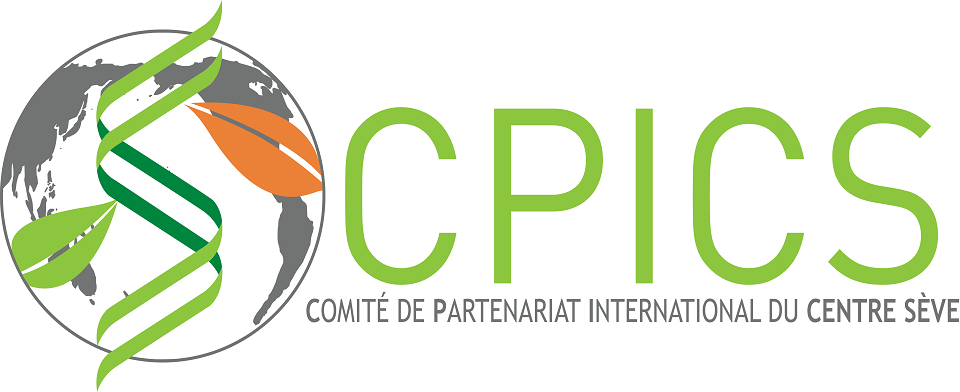

<meta charset="utf-8">
<meta name="viewport" content="width=device-width, initial-scale=1">

 
 [<i class="fab fa-twitter"></i>](https://twitter.com/CPICSEVE) [<i class="fab fa-linkedin-in"></i>](https://www.linkedin.com/company/cpics/about/)
[<i class="fab fa-facebook"></i>](https://www.facebook.com/CPICS-Comit%C3%A9-de-partenariat-international-du-Centre-S%C3%88VE-395275957711442)

    

  

  <a class="twitter-timeline" data-height="800" href="https://twitter.com/CPICSEVE?ref_src=twsrc%5Etfw">Tweets by CPICS</a> 
  
  <i class="fas fa-envelope" align="center" style="float:left;padding:2px"></i> 
 cpicseve@gmail.com

  

  

*Français*

  
Fondé en 2018, le **_Comité de partenariat international du Centre SÈVE(CPICS)_** est un comité étudiant composé d’étudiant(e)s de 2e et 3e cycle affilié(e)s au **_Centre SÈVE_**. Articulé par une dizaine d’étudiant(e)s provenant des universités québécoises, le **_CPICS_** stimule les collaborations entre les scientifiques de la province avec la communauté internationale dans le domaine de la biologie végétale. Il participe aussi au rayonnement international du réseau de recherche Québécois en favorisant une meilleure diffusion dessavoirs, allant de l’optimisation de la productivité végétale à la durabilité des écosystèmes végétaux, le tout dans un soucis de proactivité dans le contexte de changement globalactuel. 

  
  
Le **_CPICS_** donne l’occasion à des étudiant(e)s engagé(e)s de s’impliquer dans leur domainede recherche scientifique et de s’y faire connaitre, mais aussi de gérer l’organisation d’évènements bénéficiant à l’ensemble de la communauté scientifique québécoise dans le domaine des sciences végétales.

  

*English*

    
  
Created in 2018, **_Center SÈVE International Partnership Committee (CSIPC)_** is a graduate student committee member of **_Center SÈVE_**. Conducted by ten students from Quebec Universities, **_CSIPC_** increase collaborations between Quebec and international researchers in plant biology field. **_CSIPC_** stimulate Quebec research networking by a better broadcast of knowledge from its community through plant productivity or ecosystem sustainability, all together with a proactive behavior facing the actual global changing. 

  
  
**_CSIPC_** is an opportunity for involved student to contribute to their scientific community and manage the organization of events that benefit the whole scientific community of Plant biologists from Quebec.

  

  

