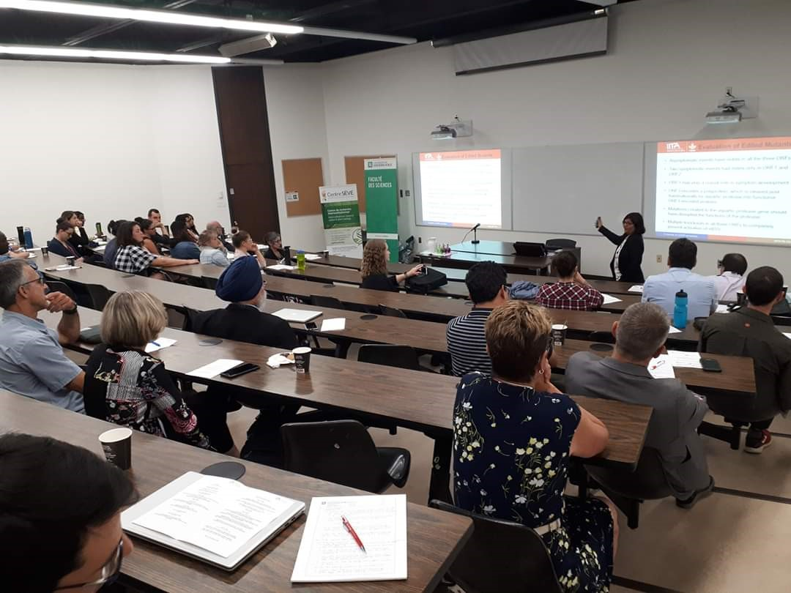

#

#

#

#

#

#   {.tabset .tabset-fade} 
## **Upcoming**

_What's up?_ Conferences

## **Past**   {.tabset .tabset-fade} 

#### *2019*  {.tabset .tabset-fade} 

##### Professors

<table style="width:100%; border: none;">
  <tr>
    <td align="center" class="photos">
        
    </td>
    <td align="center" class="photos" style="height: 4em"> 
        
    </td>
  </tr>
</table>

##### Photos

