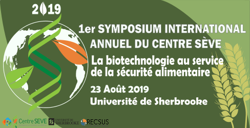
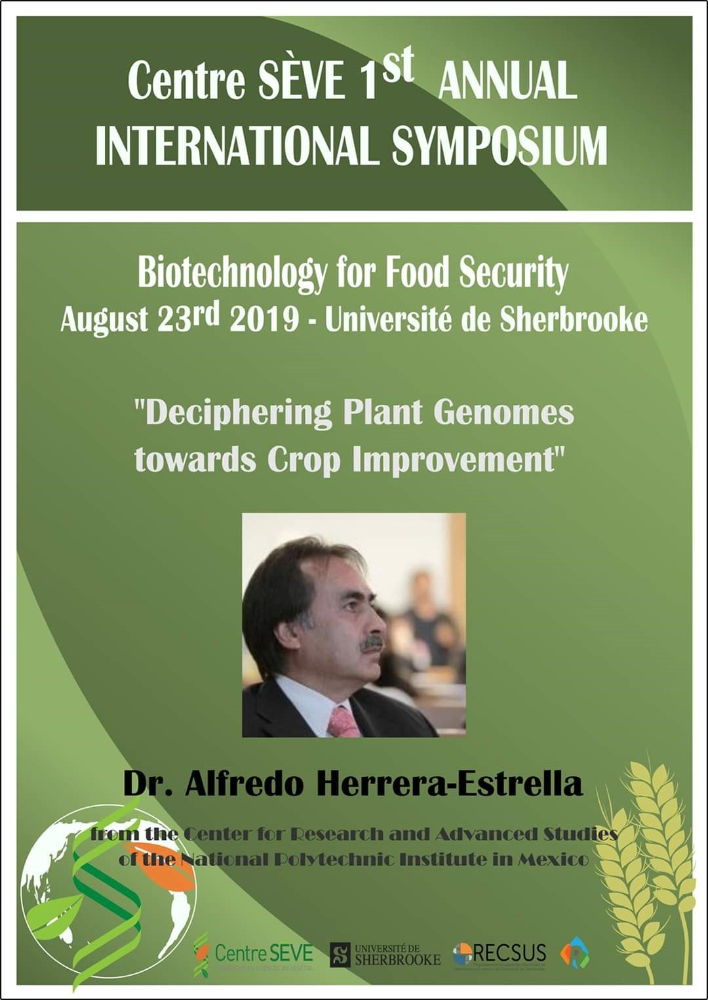
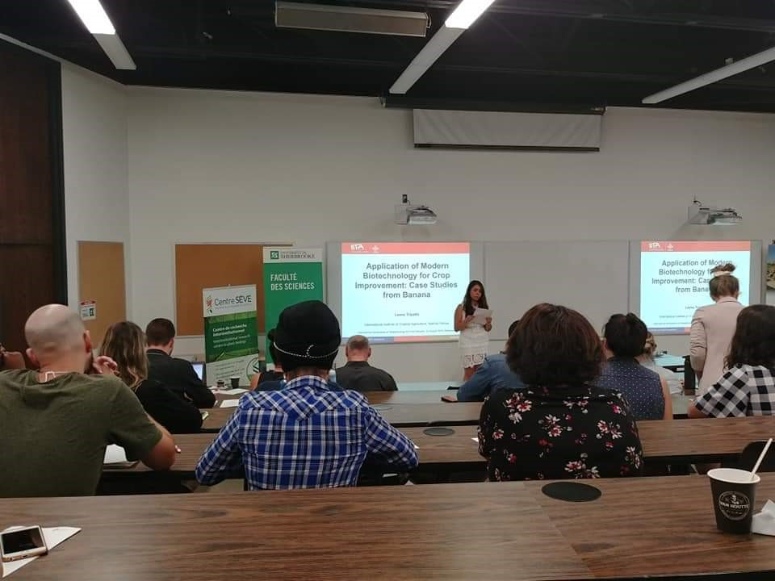

<meta charset="utf-8">
<meta name="viewport" content="width=device-width, initial-scale=1">

<section>

<nav style="display: block">
    

Le *Symposium annuel international du Centre SÈVE* est un rassemblement scientifique qui reflète la philosophie du **_CPICS_**. Son objectif est, non seulement, de renforcer et de développer   un   réseau   international   du _Centre SÈVE_,   mais   aussi   de   permettre   aux étudiant(e)s affilié(e)s au _Centre SÈVE_ de rencontrer des scientifiques de renommées internationales et de profiter du partage de leur connaissances. C’est une occasion pourtoute la communauté du _Centre SÈVE_ d’agrandir son réseau et de faire naitre de nouvelles collaborations, autant à l’échelle canadienne qu’à l’échelle mondiale. C’est également un moment privilégié pour les étudiant(e)s pour qui c’est l’occasion de présenter leurs travaux devant leur pairs, profitant de la proximité que favorise l’évènement. 

</nav>

<article>
  
  
The *Annual International Symposium of Center SÈVE* is a scientific meeting which reflects **_CSIPC_**’s philosophy. Its objective is to develop _Center SÈVE_'s international network of  and, at the same time, give a chance to student members to meet international researcher. This is an opportunity to increase _Center SÈVE_'s visibility at international scene but also to create   new  collaborations   between   Canadians  and   international   researchers.   Student members take advantage of this privileged event to present their own research in front of their peers, enjoying the proximity favored by the event.

 </article> 
</section>

#  {.tabset .tabset-fade .tabset-pills}

## Program 

<table style="width:100%; border: none;">
  <tr>
    <td align="center" class="photos">
        
    </td>
    <td align="center" class="photos" style="height: 4em"> 
    </td>
  </tr>
</table>

## Professors / Professeurs

<table style="width:100%; border: none;">
  <tr>
    <td align="center" class="photos">
        
    </td>
    <td align="center" class="photos" style="height: 4em"> 
        
    </td>
  </tr>
</table>

## Photos

