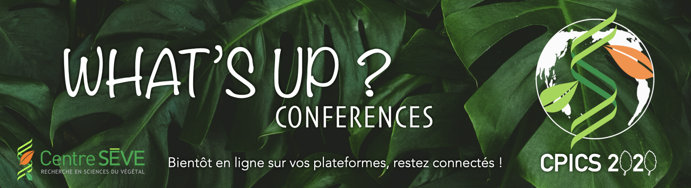
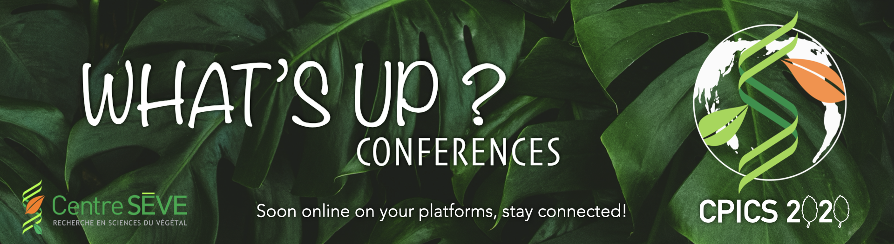

<meta charset="utf-8">
<meta name="viewport" content="width=device-width, initial-scale=1">

#

#

#

#

#

<figure>
  
  <figcaption>Discussions avec 2 chercheurs invités (international et Québec) !</figcaption>
</figure>

<figure>
  
  <figcaption>Discussions with 2 guest researchers (international and Quebec) !</figcaption>
</figure>

